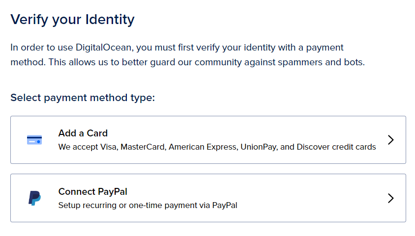
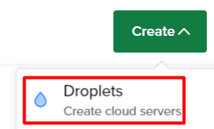

# digitalocean-stake-wars-iii
Гайд по развертыванию ноды NEAR Protocol на хостинге DigitalOcean

Регистрация
========================
Для начала нам нужно зарегистрироваться на хостинге DigitalOcean

Сайт - https://cloud.digitalocean.com/registrations/new

Выбираем удобный способ регистрации и регистрируемся

Оплата
========================
После регистрации DigitalOcean сразу же запросит привязку банковской карты или небольшое пополнение через PayPal

Если привязать карту, то спишется 1$, но он сразу же зачислиться обратно

Все новые пользователи получают 100$ на свой баланс, их можно потратить в течении 60 дней

Создание виртуального сервера
========================
В новом проекте нажимаем Create и выбираем Droplets

Самый оптимальный вариант это Ubuntu 22.04 x64 - Basic - Regular with SSD - 8 GB / 4 CPU - 160 GB SSD disk - 5 TB transfer по цене 48$ за месяц

Запуск консоли
========================
После создания Droplet, заходим в него, там будет кнопка Console, при её нажатии откроется консоль

Запуск ноды валидатора
========================
Обновляем все пакеты

sudo apt update && sudo apt upgrade -y

Устанавливаем Node.js и npm

>curl -sL https://deb.nodesource.com/setup_18.x | sudo -E bash -  
>
>sudo apt install build-essential nodejs
>
>PATH="$PATH"

Версия Node.js должна быть 18.x.x, а версия npm 8.x.x

>node - v
>
>npm -v

Устанавливаем NEAR-CLI

>sudo npm install -g near-cli

Устанавливаем shardnet, как сеть где будет работать NEAR-CLI

>export NEAR_ENV=shardnet

Устанавливаем нужные пакеты

>sudo apt install -y git binutils-dev libcurl4-openssl-dev zlib1g-dev libdw-dev libiberty-dev cmake gcc g++ python3 docker.io protobuf-compiler libssl-dev pkg-config clang llvm cargo

Устанавливаем pip

>sudo apt install python3-pip

Если есть проблемы с установкой docker то пропишите:

>apt-get install containerd=1.3.3-0ubuntu2

Устанавливаем конфигурацию

>USER_BASE_BIN=$(python3 -m site --user-base)/bin
>
>export PATH="$USER_BASE_BIN:$PATH"

Устанавливаем Building env

>sudo apt install clang build-essential make

Устанавливаем Rust и Cargo

>curl --proto '=https' --tlsv1.2 -sSf https://sh.rustup.rs | sh

В меню выбираем цифру 1

Прописываем

>source $HOME/.cargo/env

Скачиваем nearcore

>git clone https://github.com/near/nearcore
>
>cd nearcore
>
>git fetch

Проверяем commit. Commit - https://github.com/near/stakewars-iii/blob/main/commit.md

>git checkout <commit>

Компилируем nearcore
  
>cargo build -p neard --release --features shardnet
  
Папка - target/release/neard

Инициализируем рабочую папку
>./target/release/neard --home ~/.near init --chain-id shardnet --download-genesis

Заменяем config.json на нужный

>rm ~/.near/config.json
>
>wget -O ~/.near/config.json https://s3-us-west-1.amazonaws.com/build.nearprotocol.com/nearcore-deploy/shardnet/config.json
 
Запускаем ноду

>cd ~/nearcore
>
>./target/release/neard --home ~/.near run

Логинимся
 
>near login
  
Копируем ссылку в браузер и там логинимся в свой аккаунт, после этого вписываем свой адресс в командую строку

Проверяем validator_key.json

>cat ~/.near/validator_key.json
  
Если validator_key.json отсутсвует, то создаем его

>near generate-key <pool_id>

pool_id - имя вашего пула, <pool_id>.factory.shardnet.near

Копируем ключ в nearcore
  
>cp ~/.near-credentials/shardnet/ВАШ_КОШЕЛЕК.json ~/.near/validator_key.json
  
Заменяем в ключе account_id на <pool_id>.factory.shardnet.near
  
А private_key на secret_key

Запускаем валидатора

>target/release/neard run
  
Настраиваем neard

>sudo vi /etc/systemd/system/neard.service

>[Unit]
>
>Description=NEARd Daemon Service
>
>[Service]
>  
>Type=simple
> 
>User=USER
> 
>#Group=near
>  
>WorkingDirectory=/USER/.near
> 
>ExecStart=/USER/nearcore/target/release/neard run
>  
>Restart=on-failure
>  
>RestartSec=30
>  
>KillSignal=SIGINT
> 
>TimeoutStopSec=45
> 
>KillMode=mixed
>
>[Install]
> 
>WantedBy=multi-user.target
>
  
Вместо USER пишем имя нашего пользователя 
  
Потом включаем neard:

>sudo systemctl enable neard
>  
>sudo systemctl start neard
  

Посмотреть журнал:
  
>journalctl -n 100 -f -u neard
  
Устанавливаем цвет для журнала:
  
>sudo apt install ccze
  
Просмотр журнала с цветом:
  
>journalctl -n 100 -f -u neard | ccze -A
  
Разворачиваем контракт стейкинг пула:
  
>near call factory.shardnet.near create_staking_pool '{"staking_pool_id": "<pool id>", "owner_id": "<accountId>", "stake_public_key": "<public key>", "reward_fee_fraction": {"numerator": 5, "denominator": 100}, "code_hash":"DD428g9eqLL8fWUxv8QSpVFzyHi1Qd16P8ephYCTmMSZ"}' --accountId="<accountId>" --amount=30 --gas=300000000000000

pool id и staking_pool_id - имя вашего пула, которое вы указали в validator_key.json, accountId - имя вашего обычного аккаунта, public key - публичный ключ из validator_key.json
 
Обновить настройки стейкинг пула:
  
>near call <pool_name> update_reward_fee_fraction '{"reward_fee_fraction": {"numerator": 1, "denominator": 100}}' --accountId <account_id> --gas=300000000000000

Общий баланс команды:

>near view <pool_id> get_account_total_balance '{"account_id": "<accountId>"}'
  
Застейканный баланс:

>near view <pool_id> get_account_staked_balance '{"account_id": "<accountId>"}'
  
Анстейкнутый баланс:
  
>near view <pool_id> get_account_unstaked_balance '{"account_id": "<accountId>"}'
  
Доступное для вывода:

>near view <pool_id> is_account_unstaked_balance_available '{"account_id": "<accountId>"}'
 
Количество везде указывается в yoctoNEAR

Застейкать:
  
>near call <staking_pool_id> deposit_and_stake --amount <amount> --accountId <accountId> --gas=300000000000000

Разстейкать:

>near call <staking_pool_id> unstake '{"amount": "<amount yoctoNEAR>"}' --accountId <accountId> --gas=300000000000000

Разстейкать все:

>near call <staking_pool_id> unstake_all --accountId <accountId> --gas=300000000000000

Анстейк занимает 2-3 эпохи
  
Пинг:
  
>near call <staking_pool_id> ping '{}' --accountId <accountId> --gas=300000000000000
  
Пауза/возобновление стейкинга:
  
>near call <staking_pool_id> pause_staking '{}' --accountId <accountId>
  
>near call <staking_pool_id> resume_staking '{}' --accountId <accountId>

Скачиваем нужные пакеты:
  
>sudo apt install curl jq
  
Проверяем версию:
  
>curl -s http://127.0.0.1:3030/status | jq .version

Проверяем делегаторов и команду стейкеров:
  
>near view <your pool>.factory.shardnet.near get_accounts '{"from_index": 0, "limit": 10}' --accountId <accountId>.shardnet.near
  
Проверяем причину кика валидатора:
  
>curl -s -d '{"jsonrpc": "2.0", "method": "validators", "id": "dontcare", "params": [null]}' -H 'Content-Type: application/json' 127.0.0.1:3030 | jq -c '.result.prev_epoch_kickout[] | select(.account_id | contains ("<POOL_ID>"))' | jq .reason

Проверяем созданные или ожидаемые блоки:
  
>curl -s -d '{"jsonrpc": "2.0", "method": "validators", "id": "dontcare", "params": [null]}' -H 'Content-Type: application/json' 127.0.0.1:3030 | jq -c '.result.current_validators[] | select(.account_id | contains ("POOL_ID"))'

Задания
========================
Полный список заданий доступен на https://github.com/near/stakewars-iii/blob/main/challenges/challenge-summary.md

При их выполнении вы будете получать UNP и DNP

UNP - 1 разблокированный токен NEAR
DNP - 500 токенов NEAR делегированных на 1 год
