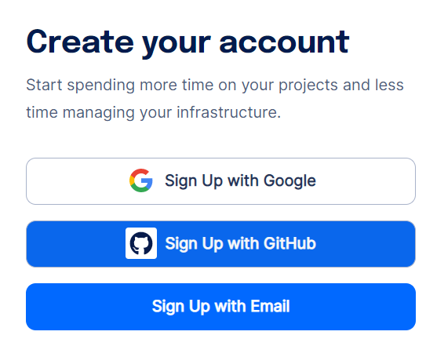

# digitalocean-stake-wars-iii
Гайд по развертыванию ноды NEAR Protocol на хостинге DigitalOcean

Регистрация
========================
Для начала нам нужно зарегистрироваться на хостинге DigitalOcean

Сайт - https://cloud.digitalocean.com/registrations/new

Выбираем удобный способ регистрации и регистрируемся

Оплата
========================
После регистрации DigitalOcean сразу же запросит привязку банковской карты или небольшое пополнение через PayPal

Если привязать карту, то спишется 1$, но он сразу же зачислиться обратно

Все новые пользователи получают 100$ на свой баланс, их можно потратить в течении 60 дней

Создание виртуального сервера
========================
В новом проекте нажимаем Create и выбираем Droplets

Самый оптимальный вариант это Ubuntu 22.04 x64 - Basic - Regular with SSD - 8 GB / 4 CPU - 160 GB SSD disk - 5 TB transfer по цене 48$ за месяц

Запуск консоли
========================
После создания Droplet, заходим в него, там будет кнопка Console, при её нажатии откроется консоль

Запуск ноды валидатора
========================
Обновляем все пакеты

sudo apt update && sudo apt upgrade -y

Устанавливаем Node.js и npm

<&curl -sL https://deb.nodesource.com/setup_18.x | sudo -E bash -  
sudo apt install build-essential nodejs
PATH="$PATH"&>

Версия Node js должна быть 18.x.x, а версия npm 8.x.x

Задания
========================
Полный список заданий доступен на https://github.com/near/stakewars-iii/blob/main/challenges/challenge-summary.md

При их выполнении вы будете получать UNP и DNP

UNP - 1 разблокированный токен NEAR
DNP - 500 токенов NEAR делегированных на 1 год
